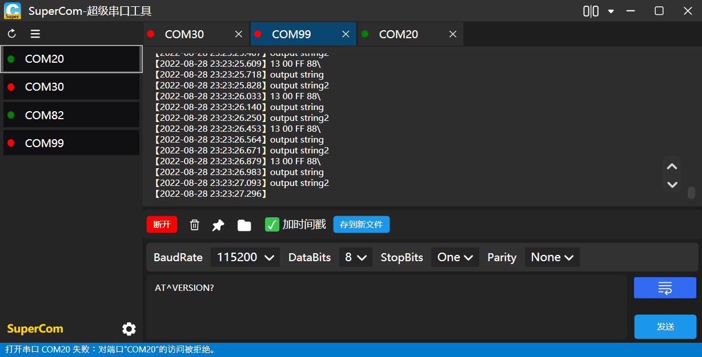
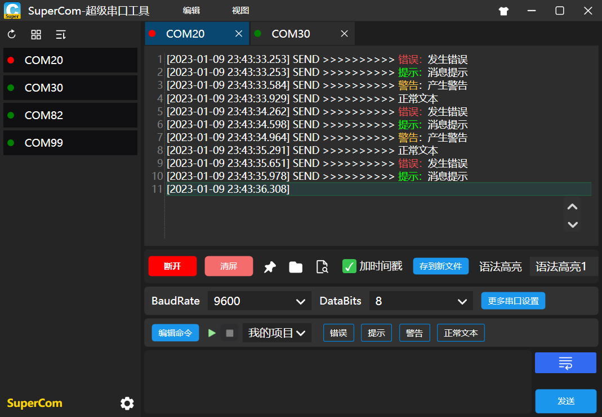
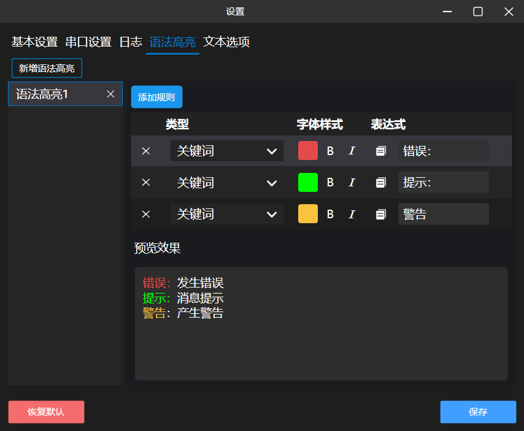
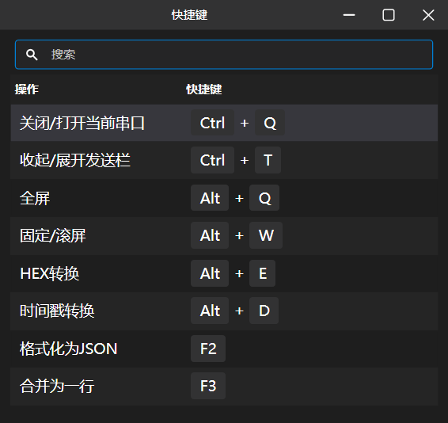
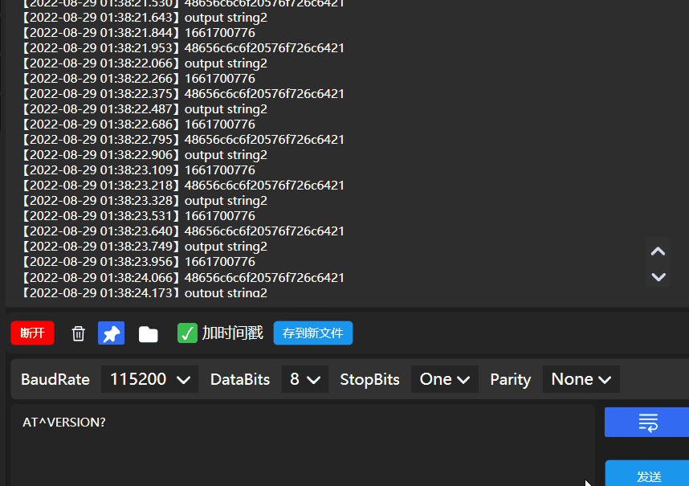

[中文](README.md) [English](README_EN.md) 


<h1 align="center">SuperCom</h1>

[](#)
[](#)
[](#)
[](https://github.com/SuperStudio/SuperCom)
[](https://github.com/SuperStudio/SuperCom/fork)

SuperCom 是一款**串口调试工具**，用于 Window 串口的调试

下载地址：[点此下载](https://github.com/SuperStudio/SuperCom/releases)



# 关于

SuperCom 是一款**美观**、**流畅**、**功能丰富**、**高效**的串口调试工具，支持以下特点：

- 同时打开多个串口进行监听
- 串口日志自动保存
- 串口日志支持滚屏/固定
- 可以设置波特率、位大小等串口设置
- 可发送各种 AT 指令
- 具有各种特性

## 创新特性

**一、语法高亮**



可自定义



**二、命令自动运行**


或者


**三、快捷键**



**四、插件与皮肤**


切换皮肤


五、在线升级


六、支持 HEX 与字符串互转


七、支持时间戳与北京时间互转



八、格式化 JSON 与合并行


# 文档

用户文档：[Wiki](https://github.com/SuperStudio/SuperCom/wiki)

开发者文档：

# 分支说明

| 分支名           | 说明                                                   |
| ---------------- | ------------------------------------------------------ |
| master           | 主分支，其它用户拉取的主要代码，同时也是 PR 的目标分支 |
| dev-chao         | 私人的开发分支，避免影响到他人拉取                     |
| release_20220930 | 发布分支，用于各个项目引用，保证稳定的依赖关系         |

每 3 个月更新一次 release 分支


# 关于虚拟化串口

工具来源于：[com0com](https://sourceforge.net/p/com0com/)

命令行用法

```
Usage:
  [options] <command>

Options:
  --output <file>              - file for output, default is console
  --wait [+]<to>               - wait <to> seconds for install completion. If
                                 <to> has '+' prefix then ask user to continue
                                 waiting after <to> seconds elapsing
                                 (by default <to> is 0 - no wait)
  --detail-prms                - show detailed parameters
  --silent                     - suppress dialogs if possible
  --no-update                  - do not update driver while install command
                                 execution (the other install command w/o this
                                 option expected later)
  --no-update-fnames           - do not update friendly names
  --show-fnames                - show friendly names activity

Commands:
  install <n> <prmsA> <prmsB>  - install a pair of linked ports with
   or                            identifiers CNCA<n> and CNCB<n>
  install <prmsA> <prmsB>        (by default <n> is the first not used number),
                                 set their parameters to <prmsA> and <prmsB>
  install                      - can be used to update driver after execution
                                 of install commands with --no-update option
  remove <n>                   - remove a pair of linked ports with
                                 identifiers CNCA<n> and CNCB<n>
  disable all                  - disable all ports in current hardware profile
  enable all                   - enable all ports in current hardware profile
  change <portid> <prms>       - set parameters <prms> for port with
                                 identifier <portid>
  list                         - for each port show its identifier and
                                 parameters
  preinstall                   - preinstall driver
  update                       - update driver
  reload                       - reload driver
  uninstall                    - uninstall all ports and the driver
  infclean                     - clean old INF files
  busynames <pattern>          - show names that already in use and match the
                                 <pattern> (wildcards: '*' and '?')
  updatefnames                 - update friendly names
  listfnames                   - for each bus and port show its identifier and
                                 friendly name
  quit                         - quit
  help                         - print this help

Syntax of port parameters string:
  -                       - use driver's defaults for all parameters
  *                       - use current settings for all parameters
  <par>=<val>[,...]       - set value <val> for each parameter <par>

Parameters:
  PortName=<portname>     - set port name to <portname>
                            (port identifier by default)
  EmuBR={yes|no}          - enable/disable baud rate emulation in the direction
                            to the paired port (disabled by default)
  EmuOverrun={yes|no}     - enable/disable buffer overrun (disabled by default)
  EmuNoise=<n>            - probability in range 0-0.99999999 of error per
                            character frame in the direction to the paired port
                            (0 by default)
  AddRTTO=<n>             - add <n> milliseconds to the total time-out period
                            for read operations (0 by default)
  AddRITO=<n>             - add <n> milliseconds to the maximum time allowed to
                            elapse between the arrival of two characters for
                            read operations (0 by default)
  PlugInMode={yes|no}     - enable/disable plug-in mode, the plug-in mode port
                            is hidden and can't be open if the paired port is
                            not open (disabled by default)
  ExclusiveMode={yes|no}  - enable/disable exclusive mode, the exclusive mode
                            port is hidden if it is open (disabled by default)
  HiddenMode={yes|no}     - enable/disable hidden mode, the hidden mode port is
                            hidden as it is possible for port enumerators
                            (disabled by default)
  AllDataBits={yes|no}    - enable/disable all data bits transfer disregard
                            data bits setting (disabled by default)
  cts=[!]<p>              - wire CTS pin to <p> (rrts by default)
  dsr=[!]<p>              - wire DSR pin to <p> (rdtr by default)
  dcd=[!]<p>              - wire DCD pin to <p> (rdtr by default)
  ri=[!]<p>               - wire RI pin to <p> (!on by default)

The possible values of <p> above can be rrts, lrts, rdtr, ldtr, rout1, lout1,
rout2, lout2 (remote/local RTS/DTR/OUT1/OUT2), ropen, lopen (logical ON if
remote/local port is open) or on (logical ON). The exclamation sign (!) can be
used to invert the value.

Special values:
  -                       - use driver's default value
  *                       - use current setting

If parameter 'PortName=COM#' is used then the Ports class installer will be
invoked to set the real port name. The Ports class installer selects the COM
port number and sets the real port name to COM<n>, where <n> is the selected
port number. Thereafter use parameter RealPortName=COM<n> to change the real
port name.

Examples:
  install - -
  install 5 * *
  remove 0
  install PortName=COM2 PortName=COM4
  install PortName=COM5,EmuBR=yes,EmuOverrun=yes -
  change CNCA0 EmuBR=yes,EmuOverrun=yes
  change CNCA0 PortName=-
  list
  uninstall
  busynames COM?*

command>

```
