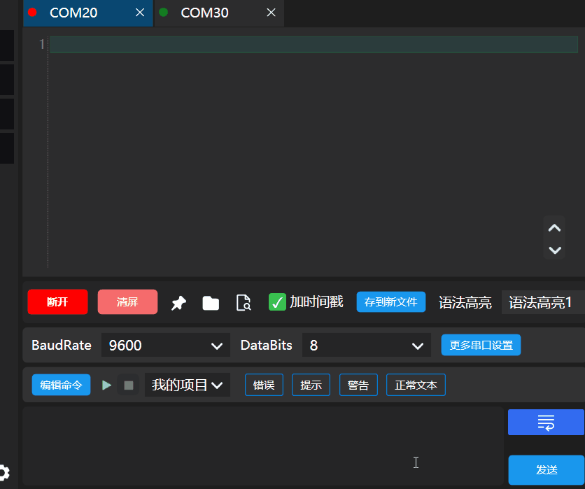
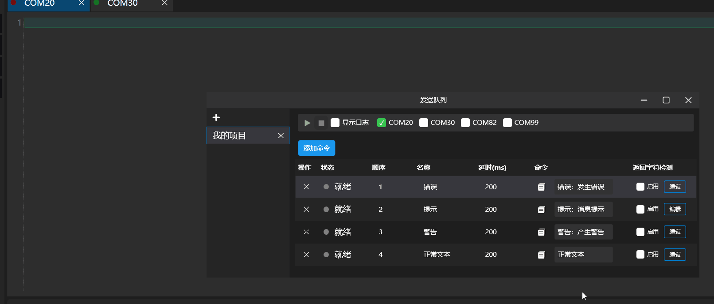
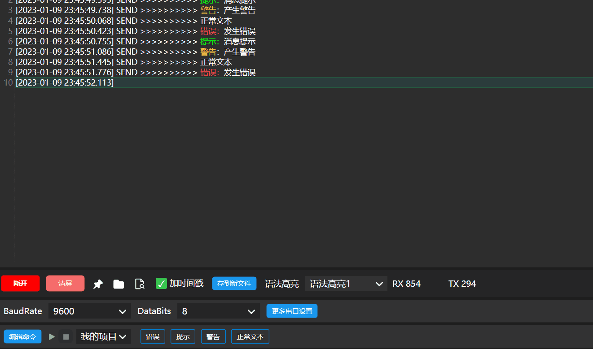
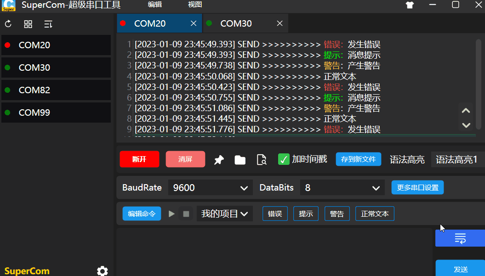
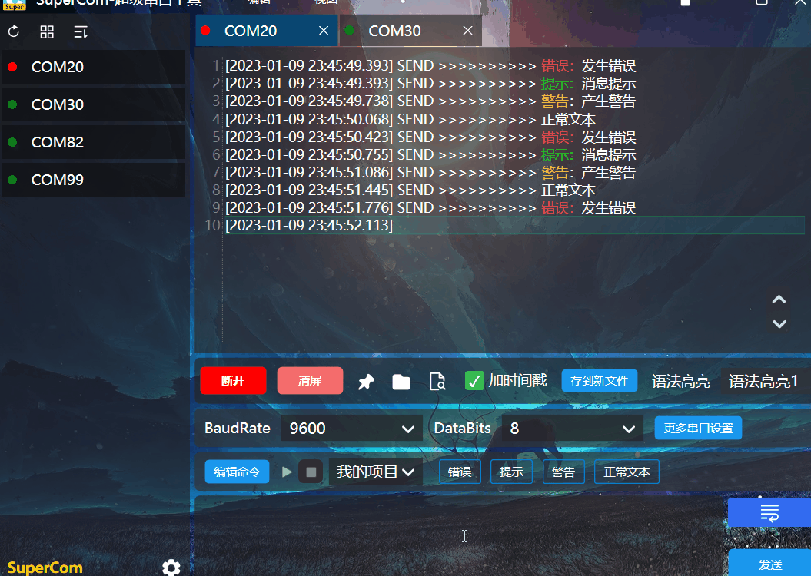
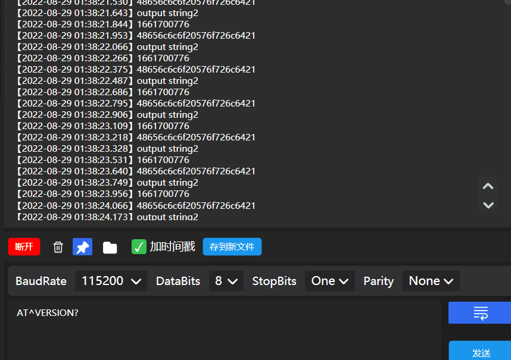
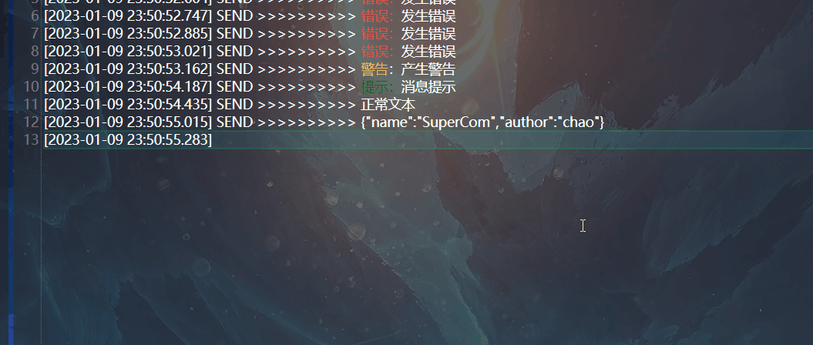

[中文](README.md) [English](README_EN.md) 

<h1 align="center">SuperCom</h1>

Supercom is the **super serial port debugging tool**, which is used for the collection, storage, visualization of Window serial logs. **Free open source!**

Download：[Here](https://github.com/SuperStudio/SuperCom/releases)

# About

Supercom is a beautiful series debugging tool for **beautiful, smooth,  rich functions, efficient**, support the following features:

- Enable multiple serial ports for listening at the same time
- Serial port logs are automatically saved
- Serial port logs support scrolling/fixation, content search, and keyword highlighting
- Allows you to set serial port Settings such as baud rate and bit size
- Can send various AT commands

1. Grammar is high

Can customize grammar highlight

2. Command automatically run

or

Three, shortcut key

Four, plug -in and skin

Switch the skin

5. Online upgrade

6. Support HEX and string mutual transfer

7. Support timestamp and Beijing time mutual turn

8. Formatting JSON and merging line

# Document

Document：[Wiki](https://github.com/SuperStudio/SuperCom/wiki)
